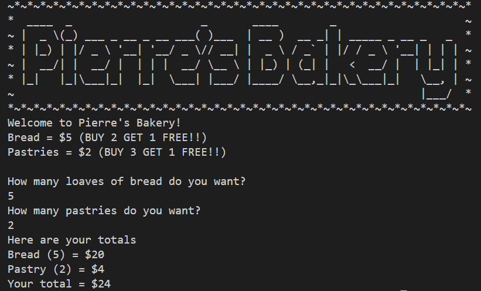

# _Pierre's Bakery Shopping Cart_

#### By _Austin Papritz_

#### _Add to your shopping cart any number of Pierre's finest bread and pastries and the system will automatically calculate your total!_

## Technologies Used

* _C#_
* _.NET_
* _Visual Studio Code_
* _ASCII art generated using http://www.patorjk.com/software/taag_

## Description

_Pierre's Bakery Shopping Cart is a console app that will guide you through the process of adding bread and pastry to your shopping cart. Once you enter the quantities, the app will automatically apply any discounts and calculate your total._

## Setup/Installation Requirements

* _`Download ZIP` by clicking on the big green `Code` button_
* _Extract the ZIP file_
* _Run `Program.cs` in your favorite terminal app (e.g., GitBash, VS Code, iOS/Linux terminal)_
* _Enjoy!_

## Known Bugs

_none_

## License

_If you run in to any problems or have any suggestions/improvements, feel free to contact me on [linkedIn](https://www.linkedin.com/in/austin-papritz)!_

Copyright (c) _July 14, 2023_ _Austin Papritz_